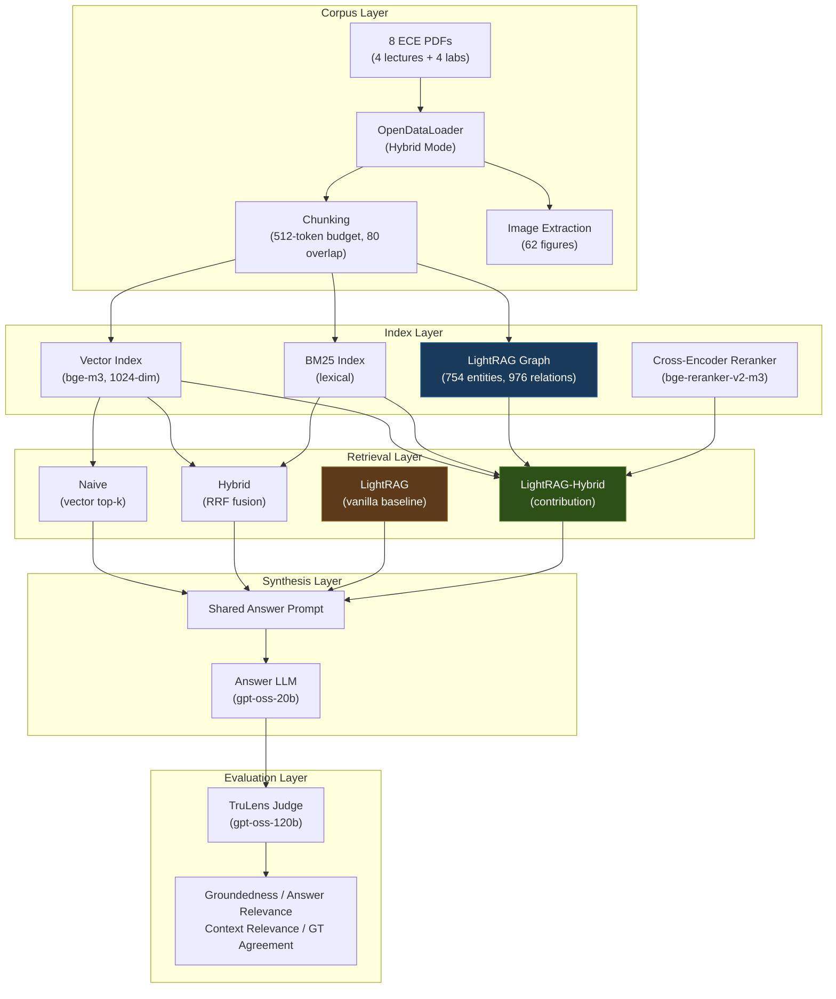
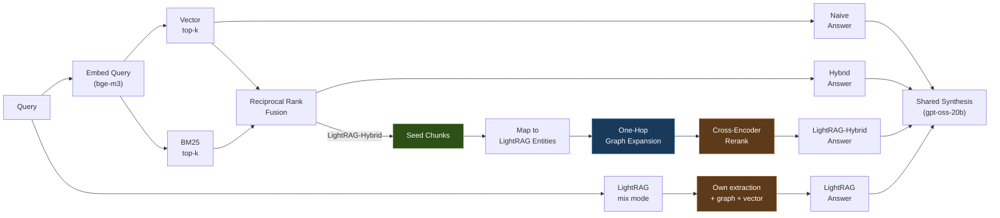
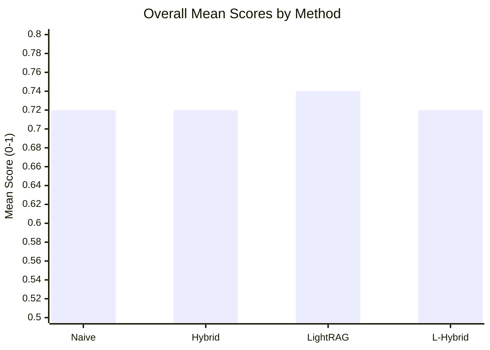
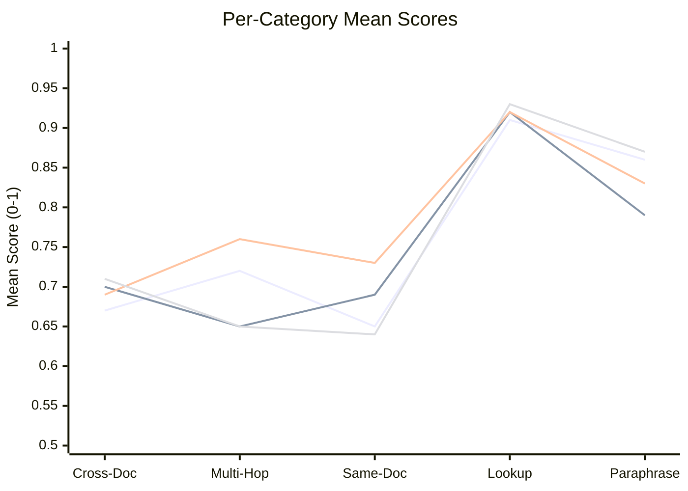

# Graph-Augmented Hybrid RAG for Educational Engineering Content

## Abstract

This work evaluates when graph-augmented retrieval improves answer quality over
naive and hybrid baselines in a Retrieval-Augmented Generation (RAG) system over
educational Electrical and Computer Engineering (ECE) material. We implement
four retrieval methods --- dense vector (naive), hybrid (BM25 + vector with
reciprocal rank fusion), a vanilla LightRAG baseline, and **LightRAG-Hybrid**,
our contribution, which uses BM25+vector RRF seeds followed by one-hop expansion
over LightRAG's own knowledge graph --- and compare them using the **TruLens**
LLM-as-judge suite on a **0--1** scale across 40 questions spanning five
cognitive categories. Vanilla LightRAG achieves the highest overall mean
(**0.74**), with naive, hybrid, and LightRAG-Hybrid effectively tied at **0.72**.
LightRAG wins multi-hop (0.76) and same-document (0.73) questions via its
dual-level retrieval; LightRAG-Hybrid wins cross-document (0.71), lookup (0.93),
and paraphrase (0.87) via BM25-augmented seeding. A uniform capacity fallback
resolved every empty model answer across all methods (0 unresolved).

---

## 1. Introduction

Retrieval-Augmented Generation (RAG) systems [1] combine information retrieval with
large language model (LLM) synthesis to ground answers in source documents.
While naive vector retrieval works well for simple queries, educational
content often requires cross-document reasoning, prerequisite chains, and
concept linking --- scenarios where pure similarity search may miss critical
context.

This study investigates whether augmenting hybrid retrieval with structured
knowledge graph expansion improves answer quality on ECE lecture and lab
material. The approach is inspired by graph-augmented RAG systems such as
LightRAG [2], which demonstrate that structured knowledge graphs can enhance
retrieval beyond simple similarity search. The core hypothesis is that one-hop
graph expansion from retrieved seed chunks surfaces related concepts and
formulas that vector search alone does not reach, particularly for questions
requiring multi-document synthesis.

### 1.1 Contributions

- A modular RAG pipeline comparing **four** retrieval strategies under identical
  answer synthesis, embedding, and judging conditions for a fair system-vs-system
  comparison.
- **LightRAG-Hybrid** (the primary contribution): a retrieval policy that
  replaces LightRAG's native seed retrieval with BM25+vector hybrid RRF seeds
  while reusing LightRAG's own extracted graph, read read-only from persisted
  artifacts with no `lightrag-hku` runtime dependency on the contribution path.
- A figure-aware retrieval mechanism that deterministically links extracted
  diagrams to their enclosing text chunks, making figure references reachable
  for every method through a uniform, method-agnostic attachment step.
- An empirical evaluation across 40 categorized questions with the **TruLens**
  LLM-judge suite (RAG triad + ground-truth agreement) on a 0--1 scale,
  including a uniform capacity fallback for empty answers.

---

## 2. System Architecture

### 2.1 Overview

The system follows a layered architecture separating corpus processing,
indexing, retrieval, and evaluation concerns.

### 2.2 Query-Time Flow

---

## 3. Corpus & Preprocessing

### 3.1 Source Documents

The corpus consists of 8 PDF documents from an undergraduate ECE course,
producing **150 chunks** after re-chunking without AI figure-description text:

| Document | Type | Pages | Chunks | Topic |
|----------|------|-------|--------|-------|
| Chapter 1: Error in Measurement | Lecture | 22 | 25 | Error taxonomy, statistics, propagation |
| Lab 1 | Lab | 5 | 12 | Resistor measurements, uncertainty |
| Chapter 3: DC & AC Bridges | Lecture | 37 | 37 | Bridge circuits, balance equations |
| Lab 2 | Lab | 1 | 2 | Bridge experiments |
| Chapter 4: Oscilloscope | Lecture | 12 | 11 | CRO, Lissajous figures, triggering |
| Lab 3 | Lab | 2 | 4 | Oscilloscope applications |
| Chapter 5: ADC and DAC | Lecture | 52 | 54 | Sampling, converter architectures |
| Lab 4 | Lab | 3 | 5 | ADC0808 testing |

**Total: 150 chunks, 62 extracted figures (all 62 linked to a host chunk)**

### 3.2 Document Parsing

Documents are parsed using OpenDataLoader [9] in hybrid mode, which routes complex
pages (tables, formulas, images) to the Docling AI backend while keeping
simple text pages on the fast Java path. This provides:

- Structure-aware element extraction (paragraphs, headings, captions, tables)
- Bounding box metadata for figures
- AI-generated picture descriptions for diagram content
- Formula enrichment via LaTeX extraction

### 3.3 Chunking Strategy

Chunks are produced with a 512-unit budget and 80-unit overlap. The chunker walks
the document element tree in order, splitting on page boundaries and on exceeding
the chunk size limit. Each chunk carries structured metadata:

- `chunk_id`: Deterministic identifier (`doc_id::ch_NNNNN`)
- `page_number`: Source page for citation
- `element_type`: Document element type (paragraph, heading, caption, formula)
- `linked_image_ids`: Reverse index to figures whose captions or descriptions
  are associated with this chunk

### 3.4 Figure-Aware Retrieval

A key design feature is the deterministic linkage between figures and their
enclosing text chunks. During parsing, OpenDataLoader assigns each image a
`linked content id` that connects it to its caption element, and the chunking
pipeline records which chunk hosts each figure (`linked_image_ids`).

**At query time, identical for every method:** when a method retrieves a set of
chunks, the system looks up `images.json` for figures whose `linked_chunk_id`
matches a retrieved chunk. Up to the top-3 images (by their host chunk's
retrieval score) are returned alongside the answer as **references**
(`source_path`, `caption_text`, `ai_description`). The text-only answer model
consumes caption text present in the chunk; images themselves are not read as
pixels in this iteration.

> **Change in this iteration.** AI-generated picture descriptions are **no
> longer merged into chunk text** (the caption path is retained, but this corpus
> contains ~0 true captions). The previous iteration merged 5,482 words of mostly
> low-quality, sometimes hallucinated descriptions --- 35.5% of corpus words ---
> into the chunk text, diluting the retrieval signal for every method. Removing
> them changed chunk boundaries (221 → 150 chunks) and required a full re-index
> and re-run.

### 3.5 Incremental Ingest

The system supports incremental document addition. Each document is hashed
at ingest time using SHA-256 over its content; unchanged documents (by content
hash) skip re-chunking and re-embedding. Only new or modified documents enter
the index.

---

## 4. Retrieval Methods

### 4.1 Method 1: Naive Vector Retrieval

The baseline uses dense vector similarity search exclusively.

**Pipeline:** Query $\rightarrow$ Embed (bge-m3) $\rightarrow$ Vector top-k $\rightarrow$ Answer

The embedding model `BAAI/bge-m3` [5] produces 1024-dimensional dense vectors.
Retrieval selects the $k$ chunks with highest cosine similarity to the query:

$$\text{score}(q, c) = \frac{\mathbf{e}_q \cdot \mathbf{e}_c}{\|\mathbf{e}_q\| \, \|\mathbf{e}_c\|}$$

**Configuration:** $k = 6$

### 4.2 Method 2: Hybrid Retrieval (RRF)

Hybrid retrieval combines lexical (BM25) [4] and semantic (vector) signals using
Reciprocal Rank Fusion (RRF) [3], which merges ranked lists without requiring score
normalization across retrievers. The LlamaIndex `QueryFusionRetriever` [10]
implements this approach off-the-shelf.

**Pipeline:** Query $\rightarrow$ [Vector top-k $\cup$ BM25 top-k] $\rightarrow$ RRF $\rightarrow$ Answer

The BM25 component scores each chunk using term frequency and inverse document
frequency:

$$\text{BM25}(q, d) = \sum_{t \in q} \text{IDF}(t) \cdot \frac{f(t, d) \cdot (k_1 + 1)}{f(t, d) + k_1 \cdot \left(1 - b + b \cdot \frac{|d|}{\text{avgdl}}\right)}$$

where $f(t, d)$ is the term frequency of $t$ in document $d$, $|d|$ is the
document length, and $k_1$, $b$ are standard tuning parameters.

RRF computes a fused score for each chunk appearing in either ranked list:

$$\text{RRF}(d) = \sum_{r \in R} \frac{1}{k_{\text{rrf}} + \text{rank}_r(d)}$$

where $R$ is the set of retrievers, $\text{rank}_r(d)$ is the rank of document
$d$ in retriever $r$'s output, and $k_{\text{rrf}} = 60$ is a smoothing
constant.

**Configuration:** Vector top-k = 6, BM25 top-k = 6

### 4.3 Method 3: Vanilla LightRAG Baseline

The vanilla LightRAG library (`lightrag-hku==1.5.4`) [2] serves as a
system-vs-system baseline, run as a pinned, throwaway black box. LightRAG builds
its own knowledge graph and indexes using the same chunk texts and chunk IDs as
the other methods, then queries in `mix` mode (graph + vector + keyword fusion)
with `only_need_context=True`. Its retrieved context is fed into the **same**
shared Groq answer prompt (`gpt-oss-20b`) and evaluated by the same judge as all
other methods, ensuring synthesis fairness.

**Pipeline:** Query $\rightarrow$ LightRAG internal extraction + indexing
$\rightarrow$ Mix-mode retrieval (graph + vector + keyword) $\rightarrow$
Answer (shared prompt).

Key implementation details:

- **Isolated working directory** (`lightrag_data/`) with JsonKVStorage,
  NetworkXStorage, and NanoVectorDBStorage.
- **Same embedding model** (`bge-m3`, 1024-dim) via a custom
  `EmbeddingFunc` wrapper.
- **Same chunk texts and IDs** as the other methods, inserted via
  `rag.ainsert(texts, ids=[...])`.
- **Extraction model:** `qwen/qwen3.8-27b` via Groq.
- **Chunk budget:** `chunk_top_k=10`.
- **No BM25** --- LightRAG's mix mode uses vector similarity + keyword
  matching + graph traversal, but no classical lexical retrieval.
- The `lightrag-hku` import is confined to exactly one module
  (`methods/lightrag_baseline.py`); deleting it does not affect the other
  methods.

LightRAG's graph statistics from its own extraction pipeline over the 150
chunks:

| Metric | LightRAG Graph |
|--------|----------------|
| Entities | 754 |
| Relations | 976 |
| Indexed chunks | 150 |

> **Note on the retired custom graph.** An earlier iteration maintained a
> separate, home-grown extraction pipeline and a `hybrid_graph` method (RRF
> seeds → one-hop expansion over our own graph). It is retained in the codebase
> but **dormant** --- excluded from this evaluation and from the published
> comparison. LightRAG-Hybrid is the graph-based contribution.

### 4.4 Method 4: LightRAG-Hybrid (Contribution)

LightRAG-Hybrid replaces LightRAG's native seed retrieval (vector over chunks +
entities + relations, with an LLM keyword-split step) with **BM25+vector hybrid
RRF seeds** (identical to Method 2), while reusing **LightRAG's own extracted
graph** (754 entities, 976 relations, read from persisted `lightrag_data/`
artifacts via `networkx` --- no `lightrag-hku` runtime dependency in the
contribution path).

**Pipeline:** Query → [Vector ∪ BM25] → RRF seeds → map to LightRAG entities
→ one-hop expansion over **both entity-adjacent and relation-attached
neighbours** (Conservative A: relations where a seed entity is src or dst) →
cross-encoder rerank → Answer.

**Conservative A relation expansion:** In addition to the entity-neighbour walk,
the method pulls chunks tagged to every relation where a seed entity appears as
either source or destination. This recovers chunks that the entity-neighbour cap
truncates, providing a "cap-recovery" mechanism. It does NOT include vector
search over relation descriptions (LightRAG's high-level channel) ---
Conservative A only reaches relations directly touching seed entities,
intentionally omitting the dual-level retrieval to isolate the effect of
BM25-augmented seeding on a richer graph.

**Budget parity:** 6 RRF seeds + 4 cross-encoder-reranked expanded = 10 chunks,
matching LightRAG's `chunk_top_k=10`. The cross-encoder, answer model, judge,
and image-attachment logic are shared with the other methods.

**Key design choices:**
- **Seeds are always preserved** --- expansion only adds context.
- **Cross-encoder on expanded chunks only** --- seeds bypass the reranker.
- **No LLM keyword extraction** --- seeds come directly from BM25+vector RRF;
  the query is not decomposed into high/low-level terms. This is the primary
  ablation variable.
- **Read-only over LightRAG artifacts** --- the graph is not rebuilt; the
  existing extraction is treated as a frozen resource.

### 4.5 Cross-Encoder Reranking

The seed-and-expand methods apply a cross-encoder reranker
(`BAAI/bge-reranker-v2-m3`) [6] to the expanded chunks before synthesis. Unlike
bi-encoders that encode query and document independently, the cross-encoder
processes the (query, chunk) pair jointly through a transformer, producing a
relevance score that captures fine-grained semantic alignment. Only the top-4
expanded chunks (by reranker score) are added to the final context. Seed
chunks bypass the reranker and are always included.

---

## 5. Knowledge Graph (LightRAG)

The graph used by LightRAG-Hybrid is **LightRAG's own**, constructed by its
extraction pipeline over the same 150 chunks (754 entities, 976 relations),
persisted under `lightrag_data/` as JSON KV stores, a NetworkX GraphML file,
and NanoVectorDB indices. LightRAG-Hybrid reads this frozen graph read-only at
query time via a thin `networkx` loader; it never triggers extraction or mutates
the graph.

LightRAG's extraction follows the pipeline described in [2]: each chunk is
processed by an LLM (`qwen/qwen3.8-27b`) to extract entities and relations with
descriptions, which are then merged (aliases, duplicate relations) and indexed.
Because the graph is fixed across both graph-based methods, any difference
between LightRAG and LightRAG-Hybrid is attributable to the **retrieval policy,
not graph construction**.

---

## 6. Answer Synthesis

### 6.1 Shared Prompt

All four methods use an identical answer synthesis prompt to ensure that the
only variable between methods is which chunks reach the LLM. The system prompt
instructs the model to:

- Base answers strictly on the provided context (no outside knowledge)
- Cite source chunks by their `chunk_id` in square brackets
- Preserve technical notation (formulas, units, variable names)
- State clearly when the context is insufficient to answer

Each retrieved chunk is formatted as `[chunk_id]\nchunk_text` and concatenated
into the user message alongside the question.

### 6.2 Fairness Controls

- **Same answer model** (`gpt-oss-20b`) and **same synthesis prompt** across
  all methods.
- **Same embedding model** (`bge-m3`) across all methods.
- **Same judge model** (`gpt-oss-120b`, via TruLens) for all evaluation.
- **Same image attachment** logic for every method.
- **Same capacity fallback** (see §7.3) applied uniformly.

---

## 7. Evaluation Setup

### 7.1 Dataset

A 40-question evaluation dataset was authored from the corpus, distributed
across five cognitive categories:

| Category | Count | Description |
|----------|-------|-------------|
| Cross-document synthesis | 16 (40%) | Requires information from 2+ documents |
| Multi-hop / prerequisite | 8 (20%) | Requires chained reasoning steps |
| Same-document conceptual | 8 (20%) | Tests understanding within one document |
| Exact-term / formula lookup | 4 (10%) | Precise formula or definition retrieval |
| Paraphrase / terminology mismatch | 4 (10%) | Uses different vocabulary than source |

Each question includes a golden answer and a list of source chunk IDs that
contain the answer evidence. Cross-document questions are validated to include
chunks from at least two distinct documents.

### 7.2 Evaluation Metrics

Four LLM-judged feedback functions are computed per (question, method) pair,
each scored on a **0--1** scale by `gpt-oss-120b` through the **TruLens**
feedback framework (LiteLLM provider) [7, 8]:

| Metric | TruLens implementation | Rubric |
|--------|------------------------|--------|
| **Groundedness** | `groundedness_measure_with_cot_reasons` | Fraction of answer claims supported by the retrieved context |
| **Answer Relevance** | `relevance_with_cot_reasons` | How directly the answer addresses the question |
| **Context Relevance** | `context_relevance_with_cot_reasons` | How relevant the retrieved context is to the question |
| **Ground Truth Agreement** | custom `generate_score_and_reasons` | Agreement between the answer and the golden answer |

The **mean score** across all four metrics is reported as the headline number.

### 7.3 Capacity Fallback for Empty Answers

`gpt-oss-20b` reasons at its default effort and occasionally exhausts its
completion budget on reasoning, returning **empty content**. Because substituting
a different answer model would break the same-model fairness lock, we apply a
uniform **capacity** fallback instead: when the first answer is empty, the
**same model** is retried with the same prompt and unchanged reasoning at
`max_completion_tokens = 8192`, up to **4 fresh samples**. The fallback is
applied identically to every method, flagged per record (`answer_fallback`), and
reported per method. On this run it rescued every empty cell (naive 2, hybrid 3,
LightRAG 3, LightRAG-Hybrid 3; **0 unresolved**).

---

## 8. Results

### 8.1 Overall Performance

Scores are on the TruLens 0--1 scale. Average latency excludes Q001 (first
question, includes one-time model-loading overhead for embedding, cross-encoder,
and graph hydration).

| Method | Groundedness | Answer Rel. | Context Rel. | GT Agreement | **Mean** | Avg. Chunks | Avg. Latency | Fallback |
|--------|:---:|:---:|:---:|:---:|:---:|:---:|:---:|:---:|
| Naive | 0.56 | 0.91 | 0.71 | 0.69 | **0.72** | 6.0 | 2.0s | 2 |
| Hybrid | 0.53 | 0.93 | 0.72 | 0.70 | **0.72** | 4.6 | 1.7s | 3 |
| **LightRAG** | 0.56 | 0.93 | **0.78** | **0.71** | **0.74** | **10.0** | 2.7s | 3 |
| LightRAG-Hybrid | 0.54 | 0.89 | 0.74 | **0.71** | **0.72** | 8.6 | 2.3s | 3 |

Latency notes: hybrid is fastest (1.7s) --- a single fusion over pre-built
indices. Naive (2.0s) adds nothing beyond one vector lookup but pays image
attachment over more chunks. LightRAG-Hybrid (2.3s) adds a graph walk +
cross-encoder rerank over BM25/vector seeds. LightRAG (2.7s) pays its native
mix-mode retrieval (graph + vector + keyword) on top of the shared synthesis.

### 8.2 Per-Category Breakdown

| Category | Naive | Hybrid | LightRAG | L-Hybrid | Best |
|----------|:---:|:---:|:---:|:---:|------|
| Cross-document (n=16) | 0.67 | 0.70 | 0.69 | **0.71** | LightRAG-Hybrid |
| Multi-hop (n=8) | 0.72 | 0.65 | **0.76** | 0.65 | LightRAG |
| Same-document (n=8) | 0.65 | 0.69 | **0.73** | 0.64 | LightRAG |
| Lookup (n=4) | 0.91 | 0.92 | 0.92 | **0.93** | LightRAG-Hybrid |
| Paraphrase (n=4) | 0.86 | 0.79 | 0.83 | **0.87** | LightRAG-Hybrid |

### 8.3 Category Wins

| Method | Categories Won |
|--------|---------------|
| LightRAG | 2/5 (multi-hop, same-document) |
| LightRAG-Hybrid | 3/5 (cross-document, lookup, paraphrase) |
| Naive | 0/5 |
| Hybrid | 0/5 |

### 8.4 Capacity Fallback

| Method | Fallback Cells | Resolved | Unresolved |
|--------|:---:|:---:|:---:|
| Naive | 2 | 2 | 0 |
| Hybrid | 3 | 3 | 0 |
| LightRAG | 3 | 3 | 0 |
| LightRAG-Hybrid | 3 | 3 | 0 |

All 11 empty answers were rescued by the uniform fallback; no method was
penalised for an unresolved empty cell. The fallback is a capacity fix, not a
model swap, so the same-answer-model fairness lock is preserved.

---

## 9. Analysis

### 9.1 Headline: a tight field

The four methods span a narrow band: LightRAG 0.74, and naive, hybrid, and
LightRAG-Hybrid all 0.72. On a 40-question set, a 0.02 gap is well within the
noise floor and should not be read as a ranking. What is informative is the
**per-category structure**, which is consistent and mechanistically explicable.

### 9.2 Where LightRAG wins

**Multi-hop (0.76) and same-document (0.73).** LightRAG has the highest context
relevance of any method (0.78 overall), reflecting its dual-level retrieval:
vector search spans entity, relation, and chunk channels, so it surfaces
topically related material even when a seed chunk's entities do not appear in the
query. For same-document conceptual questions --- which need multiple sections of
one document --- this breadth pays off. For multi-hop questions it provides the
prerequisite reach that one-hop expansion cannot.

### 9.3 Where LightRAG-Hybrid wins

**Cross-document (0.71), lookup (0.93), paraphrase (0.87).** These are exactly
the categories where BM25 lexical precision helps. Cross-document synthesis
requires matching exact technical terms across documents; lookup is literally
exact-term retrieval; and --- somewhat against the intuition that paraphrase
should punish lexical methods --- BM25's query-term overlap, combined with entity
aliasing in the graph, bridged vocabulary mismatch better than LightRAG's
LLM keyword extraction on this ECE corpus. LightRAG-Hybrid wins 3 of 5
categories.

### 9.4 Context relevance vs. answer relevance

A clear pattern separates the methods. LightRAG leads on **context relevance**
(0.78), while its **answer relevance** (0.93) ties hybrid. LightRAG-Hybrid has
the **lowest** answer relevance of the four (0.89) despite winning three
categories --- its BM25 seeds surface precisely-worded evidence, but the
Conservative-A expansion adds context that dilutes relevance slightly. Hybrid
posts the top answer relevance (0.93) with the fewest chunks (4.6), suggesting
that for this corpus, less but well-fused context produces the most on-topic
answers.

### 9.5 Groundedness is the binding constraint

Across every method, groundedness is by far the weakest metric (0.53--0.56)
while answer relevance is high (0.89--0.93). Answers are on-topic and often
agree with the golden answers, but a substantial fraction of their claims are not
fully supported by the retrieved context. Because groundedness is limited by
*what was retrieved*, and all methods still retrieve modest context (4.6--10
chunks), this suggests the ceiling here is retrieval coverage rather than
synthesis --- consistent with the graph-based methods leading slightly on
context relevance.

### 9.6 Image attachment

Figures are attached method-agnostically from the retrieved chunks. In this run,
LightRAG-Hybrid attached images to the most questions (35/40, 95 references),
followed by hybrid (29/40, 65), naive (28/40, 73), and **LightRAG (0/40, 0)**.
The zero for LightRAG is a known integration limitation: its context-only API
returns chunk text without our `chunk_id`s in the metadata, so the attachment
lookup cannot match its chunks against `images.json`. This affects only the
figure-reference side payload, not the scored text.

---

## 10. System Design Details

### 10.1 Models

| Component | Model | Purpose |
|-----------|-------|---------|
| Embeddings | `BAAI/bge-m3` [5] (1024-dim) | Dense vector representation |
| Answer synthesis | `openai/gpt-oss-20b` (Groq) | Generate answers from context |
| Evaluation judge | `openai/gpt-oss-120b` (Groq, via TruLens) | Score answer quality |
| Graph extraction | `qwen/qwen3.8-27b` (Groq) | LightRAG entity & relation extraction |
| Reranking | `BAAI/bge-reranker-v2-m3` [6] | Cross-encoder reranking |

### 10.2 Retrieval Configuration

| Parameter | Value |
|-----------|-------|
| Chunk size / overlap | 512 / 80 |
| Vector top-k | 6 |
| BM25 top-k | 6 |
| RRF $k_{\text{rrf}}$ | 60 |
| Cross-encoder top-n (expanded) | 4 |
| LightRAG / LightRAG-Hybrid chunk budget | 10 |
| Graph expansion depth | 1 hop |
| Graph neighbour cap | 2 per seed entity |
| Graph seed entity cap | 5 |
| Graph max expanded chunks | 10 |
| Max attached images | 3 |
| Fallback `max_completion_tokens` / attempts | 8192 / 4 |

### 10.3 Storage Architecture

All indices are stored as local JSON files with in-memory loading:

| Artifact | Contents |
|----------|----------|
| `chunks.json` | Chunk texts, embeddings, metadata (dict-keyed by doc_id) |
| `images.json` | Figure metadata with linked chunk references |
| `lightrag_data/` | LightRAG KV stores, NetworkX graph, NanoVectorDB indices |
| `storage/vector_store.json` | LlamaIndex persisted vector index |
| `storage/bm25_store/` | Persisted BM25 index |

---

## 11. Limitations & Future Work

### 11.1 Current Limitations

- **Dataset size:** 40 questions is suggestive but not statistically
  sufficient. Differences below ~0.10 are not separable on this set; per-category
  sample sizes (n=4 for lookup and paraphrase) are weaker still.
- **Single-hop expansion:** Deeper graph traversal may benefit cross-document
  questions but risks introducing noise.
- **Conservative A omits dual-level retrieval (LightRAG-Hybrid):** The method
  does not include LightRAG's high-level relation-vector channel --- it only
  reaches relations anchored to seed entities. This is the most likely reason it
  trails LightRAG on multi-hop and same-document questions.
- **No incremental graph merge:** The LightRAG graph is rebuilt from scratch
  when the corpus changes. Incremental graph updates are future work.
- **LightRAG image attachment:** Vanilla LightRAG's context-only API loses chunk
  IDs, so no figures are attached for that method (0/40).
- **Groundedness ceiling:** All methods score low on groundedness (0.53--0.56),
  indicating retrieved-context coverage, not synthesis, is the binding
  constraint.
- **LightRAG context budget asymmetry:** LightRAG averages exactly 10.0 chunks
  vs. 8.6 for LightRAG-Hybrid; the uniform score assigned to all LightRAG chunks
  (no per-chunk ranking from its context-only API) is a minor fairness
  discrepancy in image-attachment scoring.

### 11.2 Future Directions

- Expand evaluation to 100+ questions with human review.
- Add both the entity- and relation-vector channels to LightRAG-Hybrid
  (recover LightRAG's dual-level reach while keeping BM25 seeds).
- Investigate depth-2 graph expansion with relevance decay.
- Implement incremental graph merge for corpus updates.
- Restore the custom-graph `hybrid_graph` method to the comparison, or retire
  it, as a deliberate ablation.
- Evaluate on diverse domains beyond ECE to test generalizability.

---

## 12. Conclusion

Graph-augmented retrieval is competitive with, but not decisively better than,
naive and hybrid retrieval on this ECE corpus. Vanilla LightRAG achieves the
highest overall mean (**0.74**), with naive, hybrid, and our **LightRAG-Hybrid**
contribution tied at **0.72** --- a 0.02 spread that is within the noise floor of
a 40-question set.

The per-category structure is the more informative result. LightRAG's dual-level
retrieval wins the categories that reward broad topical reach (multi-hop 0.76,
same-document 0.73), while **LightRAG-Hybrid wins the three categories that
reward lexical precision** (cross-document 0.71, lookup 0.93, paraphrase 0.87)
by replacing LightRAG's LLM keyword gating with BM25+vector RRF seeds over
LightRAG's own graph. The two graph methods therefore fail and succeed on
complementary question types.

A uniform capacity fallback resolved every empty model answer (11 cells, 0
unresolved) without swapping models, preserving the fairness lock. Groundedness
is the binding constraint across all methods (0.53--0.56), pointing to retrieval
coverage --- not synthesis --- as the primary lever for future gains. The most
direct next step is to combine the two complementary strengths observed here:
BM25-augmented seeding with LightRAG's full dual-level (entity- and
relation-vector) retrieval.

---

## References

1. Lewis, P., Perez, E., Piktus, A., et al. (2020). "Retrieval-Augmented
   Generation for Knowledge-Intensive NLP Tasks." *Advances in Neural
   Information Processing Systems*, 33, 9459--9474.

2. Guo, Z., Xia, L., Yu, Y., et al. (2024). "LightRAG: Simple and Fast
   Retrieval-Augmented Generation." *arXiv preprint arXiv:2410.05779*.
   https://arxiv.org/abs/2410.05779

3. Cormack, G. V., Clarke, C. L. A., & Büttcher, S. (2009). "Reciprocal
   Rank Fusion outperforms Condorcet and individual Rank Learning Methods."
   *Proceedings of the 32nd International ACM SIGIR Conference on Research
   and Development in Information Retrieval*, 758--759.
   https://plg.uwaterloo.ca/~gvcormac/cormacksigir09-rrf.pdf

4. Robertson, S. E., & Walker, S. (1994). "Some Simple Effective
   Approximations to the 2-Poisson Model for Probabilistic Weighted
   Retrieval." *Proceedings of the 17th Annual International ACM SIGIR
   Conference on Research and Development in Information Retrieval*, 232--241.

5. Chen, J., Xiao, S., Zhang, P., et al. (2023). "BGE M3-Embedding:
   Multi-Lingual, Multi-Functionality, Multi-Granularity." *arXiv preprint
   arXiv:2402.03216*. https://huggingface.co/BAAI/bge-m3

6. Xiao, S., Liu, Z., Zhang, P., & Muennighof, N. (2023). "C-Pack: Packaged
   Resources To Advance General Chinese Embedding." *arXiv preprint
   arXiv:2309.07597*. https://huggingface.co/BAAI/bge-reranker-v2-m3

7. Saad-Falcon, J., Khattab, O., Potts, C., & Zaharia, M. (2023). "ARES:
   An Automated Evaluation Framework for Retrieval-Augmented Generation
   Systems." *arXiv preprint arXiv:2311.09476*.

8. Zheng, L., Chiang, W.-L., Sheng, Y., et al. (2023). "Judging LLM-as-a-Judge
   with MT-Bench and Chatbot Arena." *Advances in Neural Information
   Processing Systems*, 36.

9. OpenDataLoader. (2024). "Hybrid Mode Documentation."
   https://opendataloader.org/docs/hybrid-mode

10. LlamaIndex. (2024). "QueryFusionRetriever: Reciprocal Rerank Fusion."
    https://developers.llamaindex.ai/python/framework/integrations/retrievers/reciprocal_rerank_fusion/
